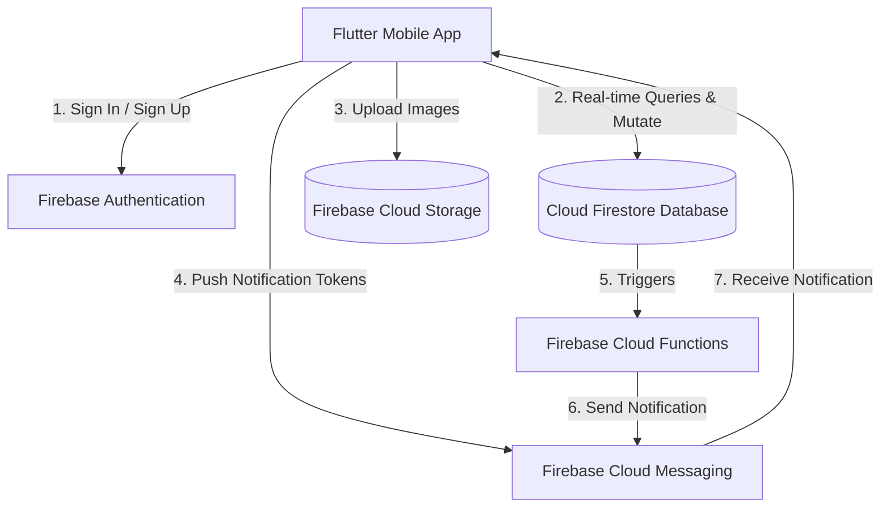

# Firebase Backend Architectural Design Document
**Project:** Lost & Found App  
**Author:** Senior Backend Architect  
**Date:** May 2026  
**Status:** Under Review  

---

## 1. Architectural Overview
This system utilizes a fully serverless, event-driven architecture built on top of the **Firebase Ecosystem**. The design prioritizes **high scalability, real-time sync, low latency, local persistence, offline support, and granular security**.



---

## 2. Cloud Firestore Schema Design
To optimize for read operations (which are 90% of a Lost & Found application's traffic) and control cost/quota limits, we adopt a hybrid schema blending **normalized relations** (for core transactions) and **denormalization** (for high-speed list views).

### 2.1 Collection: `users`
*   **Path:** `/users/{uid}`
*   **Description:** Stores user profiles, application roles, and moderation statuses.
*   **Document Structure:**
    ```json
    {
      "uid": "USER_ID_HEX",
      "email": "user@example.com",
      "name": "Tayyab Ali",
      "bio": "Avid explorer and dog lover.",
      "avatarUrl": "https://firebasestorage.googleapis.com/.../avatars/uid/profile.jpg",
      "role": "user", // "user" | "admin"
      "isBanned": false,
      "fcmToken": "FCM_REGISTRATION_TOKEN_STRING",
      "createdAt": "Timestamp",
      "updatedAt": "Timestamp"
    }
    ```

#### Subcollection: `saved_items`
*   **Path:** `/users/{uid}/saved_items/{itemId}`
*   **Description:** Stores bookmarks/saved items. Keeping this as a subcollection instead of an array inside the user document prevents hitting the 1MB Firestore document limit as user bookmarks grow.
*   **Document Structure:**
    ```json
    {
      "itemId": "REPORT_ID_HEX",
      "savedAt": "Timestamp"
    }
    ```

---

### 2.2 Collection: `reports`
*   **Path:** `/reports/{reportId}`
*   **Description:** Stores all lost and found item posts.
*   **Document Structure:**
    ```json
    {
      "id": "REPORT_ID_HEX",
      "title": "Gold Rolex Watch",
      "description": "Found a gold rolex watch near the central fountain.",
      "category": "Electronics", // "Electronics" | "Wallets" | "Keys" | "Pets" | "Bags" | "Other"
      "color": "Gold",
      "location": "Central Park, NY",
      "geoHash": "dr5regy", // Generated geohash for proximity searches
      "coordinates": {
        "latitude": 40.785091,
        "longitude": -73.968285
      },
      "isLost": true, // true = Lost, false = Found
      "status": "ACTIVE", // "ACTIVE" | "RESOLVED"
      "imageUrl": "https://firebasestorage.googleapis.com/.../reports/reportId/watch.jpg",
      "createdBy": "USER_ID_HEX",
      "reporterName": "Tayyab Ali",
      "reporterEmail": "tayyab@gmail.com",
      "reporterPhone": "+1 111 222 3333",
      "dateReported": "Timestamp",
      "createdAt": "Timestamp",
      "updatedAt": "Timestamp"
    }
    ```

---

### 2.3 Collection: `chats` (Conversations)
*   **Path:** `/chats/{chatId}`
*   **Description:** Manages chat rooms between users.
*   **Naming Convention (Document ID):** `chat_{min(uid1, uid2)}_{max(uid1, uid2)}`. This mathematical ordering guarantees that any two users will always map to the exact same chat room, avoiding duplicate records.
*   **Document Structure:**
    ```json
    {
      "id": "chat_uid1_uid2",
      "participantIds": ["uid1", "uid2"],
      "participantsInfo": {
        "uid1": {
          "name": "Tayyab Ali",
          "avatarUrl": "https://...",
          "isOnline": true
        },
        "uid2": {
          "name": "Marcus Chen",
          "avatarUrl": "https://...",
          "isOnline": false
        }
      },
      "lastMessageText": "Hi there! I think I found your wallet.",
      "lastMessageSenderId": "uid2",
      "lastMessageTimestamp": "Timestamp",
      "unreadCounts": {
        "uid1": 1,
        "uid2": 0
      },
      "relatedItemId": "REPORT_ID_HEX", // Denormalized for context banner in chat
      "relatedItemTitle": "Brown Leather Wallet",
      "relatedItemImageUrl": "https://..."
    }
    ```

#### Subcollection: `messages`
*   **Path:** `/chats/{chatId}/messages/{messageId}`
*   **Description:** Subcollection containing the sequence of messages in the room.
*   **Document Structure:**
    ```json
    {
      "id": "MESSAGE_ID_HEX",
      "text": "Hi there! I think I found your wallet.",
      "senderId": "uid2",
      "senderName": "Marcus Chen",
      "timestamp": "Timestamp",
      "imageUrl": null, // Optional if user shares an image in chat
      "read": true
    }
    ```

---

### 2.4 Collection: `notifications`
*   **Path:** `/notifications/{notificationId}`
*   **Description:** Centralized log for in-app alert lists.
*   **Document Structure:**
    ```json
    {
      "id": "NOTIFICATION_ID_HEX",
      "recipientId": "USER_ID_HEX",
      "title": "New Match Found!",
      "description": "Your lost watch matches a found watch nearby.",
      "type": "alert", // "alert" | "chat" | "system"
      "relatedItemId": "REPORT_ID_HEX",
      "isRead": false,
      "createdAt": "Timestamp"
    }
    ```

---

## 3. Firestore Security Rules (`firestore.rules`)
To achieve enterprise security without middle-tier servers, our Firestore rules validate role-based authentication, user ban states, and field-level permissions.

```javascript
rules_version = '2';
service cloud.firestore {
  match /databases/{database}/documents {

    // Helper functions
    function isAuthenticated() {
      return request.auth != null;
    }

    function isOwner(userId) {
      return request.auth.uid == userId;
    }

    function getUserData() {
      return get(/databases/$(database)/documents/users/$(request.auth.uid)).data;
    }

    function isAdmin() {
      return isAuthenticated() && getUserData().role == 'admin';
    }

    function isNotBanned() {
      return isAuthenticated() && getUserData().isBanned == false;
    }

    // ----------------------------------------------------
    // User Rules
    // ----------------------------------------------------
    match /users/{userId} {
      allow read: if isAuthenticated();
      // Only users can create/update their own profile, admins can change anything
      allow create, update: if isAdmin() || (isOwner(userId) && isNotBanned());
      allow delete: if isAdmin();

      // Saved items subcollection rules
      match /saved_items/{itemId} {
        allow read, write: if isOwner(userId);
      }
    }

    // ----------------------------------------------------
    // Reports Rules
    // ----------------------------------------------------
    match /reports/{reportId} {
      allow read: if isAuthenticated();
      // Any non-banned user can create reports
      allow create: if isNotBanned() && request.resource.data.createdBy == request.auth.uid;
      // Only owner or admin can modify/delete
      allow update: if isAdmin() || (resource.data.createdBy == request.auth.uid && isNotBanned());
      allow delete: if isAdmin() || (resource.data.createdBy == request.auth.uid);
    }

    // ----------------------------------------------------
    // Chats Rules
    // ----------------------------------------------------
    match /chats/{chatId} {
      // Allow read/write if the user is a participant
      allow read: if isAuthenticated() && (request.auth.uid in resource.data.participantIds);
      allow create: if isNotBanned() && (request.auth.uid in request.resource.data.participantIds);
      allow update: if isAuthenticated() && (request.auth.uid in resource.data.participantIds);
      allow delete: if isAdmin();

      match /messages/{messageId} {
        allow read: if isAuthenticated() && (request.auth.uid in get(/databases/$(database)/documents/chats/$(chatId)).data.participantIds);
        allow create: if isNotBanned() && 
          request.resource.data.senderId == request.auth.uid &&
          (request.auth.uid in get(/databases/$(database)/documents/chats/$(chatId)).data.participantIds);
        allow update, delete: if isAdmin() || (resource.data.senderId == request.auth.uid);
      }
    }

    // ----------------------------------------------------
    // Notifications Rules
    // ----------------------------------------------------
    match /notifications/{notificationId} {
      allow read: if isAuthenticated() && resource.data.recipientId == request.auth.uid;
      allow update: if isAuthenticated() && resource.data.recipientId == request.auth.uid && request.resource.data.diff(resource.data).affectedKeys().hasOnly(['isRead']);
      allow delete: if isAuthenticated() && resource.data.recipientId == request.auth.uid;
      // Only system (Cloud Functions/Admin SDK) can write notifications directly
      allow create: if isAdmin();
    }
  }
}
```

---

## 4. Firebase Storage Layout & Rules (`storage.rules`)
All binary uploads (photos of items, avatars) are stored in Firebase Storage with automated resource pathing.

### 4.1 Storage Layout
*   `/avatars/{uid}/avatar.jpg` - User profile picture.
*   `/reports/{reportId}/{uuid}.jpg` - Multiple photos related to an item report.
*   `/chats/{chatId}/{uuid}.jpg` - Chat-attached images.

### 4.2 Storage Rules
```javascript
rules_version = '2';
service firebase.storage {
  match /b/{bucket}/o {
    
    function isAuthenticated() {
      return request.auth != null;
    }
    
    function isOwner(userId) {
      return request.auth.uid == userId;
    }

    // Avatars rules
    match /avatars/{userId}/{allPaths=**} {
      allow read: if isAuthenticated();
      allow write: if isOwner(userId) && request.resource.contentType.matches('image/.*') && request.resource.size < 5 * 1024 * 1024; // 5MB Limit
    }

    // Report images rules
    match /reports/{reportId}/{allPaths=**} {
      allow read: if isAuthenticated();
      // Allow upload only if authenticated, creator of the report, and file size <= 10MB
      allow write: if isAuthenticated() && request.resource.contentType.matches('image/.*') && request.resource.size < 10 * 1024 * 1024 && firestore.get(/databases/$(database)/documents/reports/$(reportId)).data.createdBy == request.auth.uid;
    }

    // Chat images rules
    match /chats/{chatId}/{allPaths=**} {
      allow read: if isAuthenticated();
      allow write: if isAuthenticated() && request.resource.contentType.matches('image/.*') && request.resource.size < 8 * 1024 * 1024;
    }
  }
}
```

---

## 5. Firebase Cloud Functions Specifications
Using Cloud Functions (TypeScript) keeps heavy background workloads off the mobile client and provides high security.

### 5.1 Function: `onReportCreated` (Matchmaking Engine)
*   **Trigger:** Firestore `onCreate` on `/reports/{reportId}`
*   **Logic:**
    1.  Extract new report properties (`category`, `isLost`, `coordinates`).
    2.  Query Firestore for reports where:
        *   `category` == New Report Category
        *   `isLost` == `!newReport.isLost` (opposite status)
        *   `status` == `"ACTIVE"`
    3.  Filter results in-memory (or via Geohashes) for records within a **2-kilometer radius**.
    4.  If a match is found:
        *   Write matching documents to the `/notifications` collection for both users.
        *   Trigger a push notification via Firebase Messaging (FCM).

### 5.2 Function: `onMessageSent` (Push Alerts)
*   **Trigger:** Firestore `onCreate` on `/chats/{chatId}/messages/{messageId}`
*   **Logic:**
    1.  Fetch the parent Chat document to resolve the receiver's UID.
    2.  Query the `/users/{receiverUid}` document to extract the receiver's FCM Token.
    3.  Increment the `unreadCounts` for the receiver inside the Chat document.
    4.  Send a payload-based push notification through FCM containing:
        ```json
        {
          "notification": {
            "title": "New Message from Marcus Chen",
            "body": "Hi there! I think I found your wallet."
          },
          "data": {
            "click_action": "FLUTTER_NOTIFICATION_CLICK",
            "type": "chat",
            "chatId": "chat_uid1_uid2"
          }
        }
        ```

---

## 6. Implementation Strategy for Flutter Client
To maintain clean architecture guidelines, we will implement the client-side changes in the following sequence:

### 6.1 Dependency Injection
Using simple Singleton factories or provider structures, we will swap the existing mock implementations with Firebase-backed repositories.

### 6.2 Data Model Conversion
Extend standard `Item` and `Chat` models to gracefully handle real Firestore `Timestamp` objects instead of static date strings, and dynamically build the human-readable `timeAgo` label on-the-fly.

### 6.3 Firebase Persistence & Index Setup
Ensure local persistence is enabled inside the main initialization block:
```dart
FirebaseFirestore.instance.settings = const Settings(
  persistenceEnabled: true,
  cacheSizeBytes: Settings.CACHE_SIZE_UNLIMITED,
);
```

#### Required Composite Firestore Indexes
To make sure queries do not fail in production, the following composite indexes must be registered in `firebase.json`:
1.  **Collection:** `reports`
    *   Fields: `category` (Ascending), `createdAt` (Descending)
2.  **Collection:** `reports`
    *   Fields: `createdBy` (Ascending), `createdAt` (Descending)
3.  **Collection:** `chats`
    *   Fields: `participantIds` (Array-Contains), `lastMessageTimestamp` (Descending)
