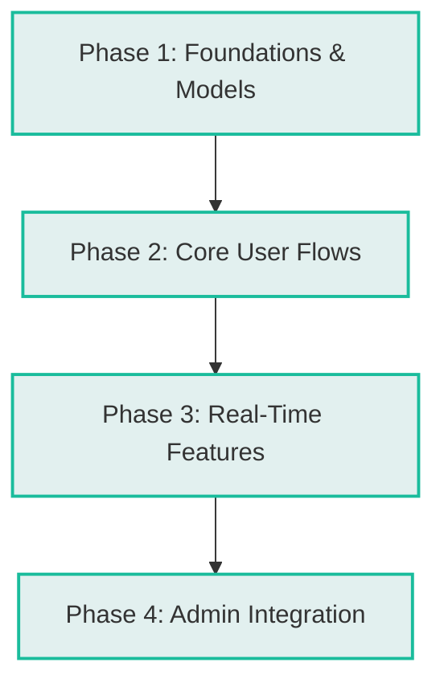

# Gap Analysis: Lost and Found Mobile Application

This document provides a comprehensive **Gap Analysis** of the **FoundIt (Lost & Found)** mobile application codebase. It evaluates the project against the architectural guidelines in [ARCHITECTURE.md](file:///d:/lost_and_found_app/lost_and_found/ARCHITECTURE.md), the required features of a production-ready community Lost & Found system, and general software engineering best practices.

---

## 1. Executive Summary

The **FoundIt** application is a Flutter project designed to reunite community members with their lost belongings. 
- **Current State:** The application has a visually high-quality, responsive presentation layer (UI) with standard color tokens and layouts. Authentication and profile updates are connected to Firebase (Auth & Firestore). However, the core features of the app (item reporting, search/feeds, chat, alerts, and notifications) are heavily dependent on local mock data and state.
- **Critical Architectural Gaps:** The project is missing core layers of the defined **Feature-Driven / Clean Architecture**. Domain models lack JSON serialization, and data-source layers (APIs, repositories) are absent for almost all features. Additionally, two fully functional Firebase-integrated admin pages are orphaned and inaccessible.

---

## 2. Directory Structure & Architecture Audit

The [ARCHITECTURE.md](file:///d:/lost_and_found_app/lost_and_found/ARCHITECTURE.md) document mandates a **Feature-Driven Architecture** organized into `core/`, `features/`, and `shared/` blocks. The following table highlights deviations in the actual implementation:

| Expected Directory / Layer | Current Status | Description & Found Gaps |
| :--- | :--- | :--- |
| **`core/constants/`** | ❌ Missing | No centralized constants for endpoints, dimensions, or keys. |
| **`core/theme/`** |  Complete | Contains `app_colors.dart`, `app_theme.dart`, and `theme_manager.dart`. |
| **`core/utils/`** | ❌ Missing | Validation regex, formatters, and logging tools are implemented ad-hoc inside UI widgets. |
| **`core/network/`** | ❌ Missing | No HTTP client or general network layer configured (only direct Firestore collections used in Auth/Admin). |
| **`core/error/`** | ❌ Missing | Missing generic `Failure` classes or global error handling models. |
| **`features/[name]/presentation/`** |  Complete | All modules have rich screens and widgets. |
| **`features/[name]/domain/`** | ⚠️ Partial | Only the `auth` feature contains a service layer (`auth_service.dart`). All other features have no domain layer, entities, use-cases, or repository interfaces. |
| **`features/[name]/data/`** | ❌ Missing | No database clients, Firestore data sources, or model mapping layers (DTOs) exist in any feature directory. |
| **`shared/widgets/`** | ⚠️ Partial | Contains `empty_state_widget.dart` and `shimmer_loader`, but global reusable items like custom buttons and textfields are duplicated inside each feature folder. |
| **`shared/services/`** | ⚠️ Partial | `SavedItemsService` (in-memory only) and `PushNotificationService` (defined but never initialized or called) are present. |

---

## 3. Detailed Feature-by-Feature Gap Analysis

### 🔑 Authentication (`features/auth`)
- **Current Implementation:** Connected to `AuthService` which uses `FirebaseAuth` for email registration, email login, Google sign-in, and password resets. Tries to create and read records in the Firestore `'users'` collection.
- **Gaps:**
  - Lacks password strength validation or real-time formatting checkers on sign-up form fields.
  - Error messages thrown by Firebase are passed directly to the UI without localized mapping or user-friendly parsing.

### 🏠 Home & Discovery (`features/home`)
- **Current Implementation:** Provides category navigation, search fields, a map view page, and a recent listings feed.
- **Gaps:**
  - **Mock Data Dependent:** All items (Sony Headphones, Golden Retriever, Wallet) are hardcoded directly into the widget files (e.g., `recent_items_list.dart`, `search_screen.dart`).
  - **No Live Feed:** Listings are not fetched from Firestore. The map view (`mock_map_widget.dart`) shows a static canvas without real pins or geolocation mapping.
  - **Search & Filter:** Search runs locally on static lists instead of querying Firestore database indexes.

### 📝 Item Reports & Submissions (`features/reports`)
- **Current Implementation:** Multi-step wizard (`create_report_screen.dart`) for uploading images, writing descriptions, selecting tags, and filling out contact details. Displays reported posts in `my_posts_screen.dart`.
- **Gaps:**
  - **Mock Form Submission:** Clicking "Submit Report" only navigates to `ReportSuccessScreen` and discards form input. It does not write to the Firestore `'reports'` collection.
  - **No Image Storage:** Selected files from `ImagePicker` are loaded as local assets; there is no integration with **Firebase Storage** to upload and retrieve item photographs.
  - **Mock Post List:** The "My Posts" screen uses hardcoded entries and a simulated 1-second delay instead of checking listings reported by the currently authenticated user ID.

### 💬 Messaging & Chat (`features/messages`)
- **Current Implementation:** Chat list screen (`messages_screen.dart`) showing open chats and an active chat interface (`chat_screen.dart`) for messaging other reporters.
- **Gaps:**
  - **Static Mock Chat:** Conversations, profile names, and text bubbles are hardcoded.
  - **No Live Synchronization:** There is no Firestore stream listening to a `'chats'` or `'messages'` subcollection to support real-time message exchange between users.

### 🔔 Notifications & Alerts (`features/notifications` & `features/alerts`)
- **Current Implementation:** UI screen for notifications (claims, matches, messages). Forms for creating security alert radius zones.
- **Gaps:**
  - **No Push Notification Hook:** `PushNotificationService` utilizes `firebase_messaging` but is never initialized in `main.dart`. Device tokens are not saved to user database records.
  - **No System Notifications:** Mock notifications are rendered locally; they do not trigger upon actions like matching items or receiving messages.
  - **No Match Engine:** There is no automated backend logic (Firestore functions or cloud schedulers) to compare category + location and trigger alerts when a lost item matches a found item.

### 🛠️ Administrative Portal (`features/admin`)
- **Current Implementation:** Includes `AdminDashboardScreen` which contains tabs for overview statistics, report moderation lists, system alerts, and profiles.
- **Orphan Screens:** The project also contains **two fully functional Firestore-connected admin files**:
  1. [admin_users_screen.dart](file:///d:/lost_and_found_app/lost_and_found/lib/features/admin/presentation/screens/admin_users_screen.dart): Lists, bans/unbans, and promotes users in real time.
  2. [admin_reports_screen.dart](file:///d:/lost_and_found_app/lost_and_found/lib/features/admin/presentation/screens/admin_reports_screen.dart): Fetches reports directly from the Firestore `'reports'` collection, resolves cases, or deletes listings.
- **Gaps:**
  - **Orphan Status:** Neither of these screens is navigated to or imported anywhere. The "Reports" tab in `AdminDashboardScreen` instead renders static visual cards with fake buttons.
  - **Mock Stats:** The main overview panel showcases hardcoded metric totals (e.g., "1,482 total reports") instead of running aggregate queries on the Firestore collection.

---

## 4. Technical Gaps & Recommendations

### 📦 Dependency & Model Gaps
- **Model Serialization:** The `Item` model (`lib/shared/models/item_model.dart`) does not support json mapping (`fromJson`, `toJson`) or firestore document mapping.
- **Storage Packages:** `pubspec.yaml` lacks dependencies for cloud file storage (e.g., `firebase_storage` or similar service package).

### 🛠️ Action Plan to Close Gaps

#### Phase 1: Foundations & Data Models
1. **Extend Models:** Add `Map<String, dynamic>` serialization to models (`Item`, `Message`, `Notification`).
2. **Setup Firebase Storage:** Add `firebase_storage` dependency to `pubspec.yaml` and configure bucket policies for item images.
3. **Establish Data Source Layers:** Build repository implementation classes under a `data/` sub-layer for auth and reports features, adhering to clean architecture.

#### Phase 2: Core User Flows (CRUD Integration)
1. **Firestore Report Submission:** Link the `CreateReportScreen` to write directly to a `'reports'` collection in Firestore.
2. **Image Upload:** Upload picked image files to Firebase Storage before writing the listing document, saving the returned HTTPS URLs.
3. **Live Item Feed:** Update `HomeScreen` and `RecentItemsList` to read live data using a StreamBuilder listening to the `'reports'` collection (ordered by date).
4. **My Posts Connection:** Modify `MyPostsScreen` to stream reports filtered by the current user's UID (`createdBy == currentUser.uid`).

#### Phase 3: Real-Time Messaging & Notifications
1. **Firestore Chat Channels:** Create a messaging repository to write chat bubbles under a `/chats/{chatId}/messages` schema and stream them to the `ChatScreen`.
2. **Notification Service Init:** Call `PushNotificationService().initialize()` inside `main.dart`. Save device tokens to the `'users'` collection on successful login.

#### Phase 4: Administrative Portal Integration
1. **Connect Orphan Screens:** Remove mock widgets from the reports tab in `AdminDashboardScreen` and replace them with `AdminReportsScreen`. Add a button to navigate to `AdminUsersScreen` for user moderator actions.
2. **Live Counters:** Add Firestore collection aggregation queries (e.g., count total items, total users) to update the dashboard overview statistics dynamically.
